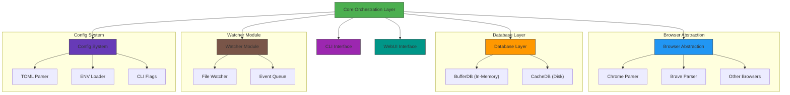

# Gosuki Technical Architecture Overview  

## 1. Project Organization  
### 1.1 Modular Architecture  
Gosuki is structured around five core components:  

- **Core Orchestration Layer** (`pkg/manager/manager.go`):  
  - Manages module initialization and coordination  
  - Handles inter-module communication via `Manager` and `WorkUnit` interfaces  

- **Browser Abstraction Layer** (`browsers/`):  
  - Supports multi-browser monitoring (Chrome, Brave, etc.)  
  - Abstracts browser-specific bookmark formats  

- **Database Layer** (`internal/database/`):  
  - Uses SQLX for SQLite persistence  
  - Separates in-memory `BufferDB` (real-time) and disk-based `CacheDB`  

- **UI Layer** (`internal/webui/`):  
  - Provides web-based interface for bookmark management  
  - Integrates with CLI for command-line operations  

- **Configuration System** (`pkg/config/`):  
  - Combines TOML, CLI flags, and ENV variables  
  - Supports module-specific and global settings  

### 1.2 Dependency Relationships  
```
Core
├── Browser (module initialization)
├── DB (storage coordination)
├── CLI (command dispatch)
├── WebUI (UI sync)
├── Watcher (real-time monitoring)
└── Config (settings management)
```  

---

## 2. Real-Time Bookmark Parsing  
### 2.1 Architecture  
Gosuki uses an event-driven model for real-time parsing:  

```go
// Pseudocode for watcher loop
func WatchLoop() {
    for {
        select {
        case event := <-watcher.Events:
            if event.Type == "modified" {
                bookmarks := ParseBookmarks(event.Path)
                UpdateCache(bookmarks)
                SyncToDB(bookmarks)
            }
        case err := <-watcher.Errors:
            HandleError(err)
        }
    }
}
```  

### 2.2 Parsing Pipeline  
1. **Event Detection**: File system watchers (`inotify`/`fsnotify`)  
2. **Parsing**: Converts raw bookmark files to `NodeTree`  
3. **Hashing**: Generates hashes for change detection  
4. **Sync**: Updates in-memory `BufferDB` and persists to `CacheDB`  

---

## 3. Bookmark Representation & Synchronization  
### 3.1 Data Structures  
- **NodeTree**:  
  ```go
  type Node struct {
      ID      string
      URL     string
      Title   string
      Tags    []string
      Children []*Node
  }
  ```  
  - Preserves hierarchy for accurate rendering  
  - Enables subtree operations  

- **URL Index**: RedBlack Tree for O(log n) lookups  
- **Tags**: Delimited strings (e.g., `tag1,tag2`) with wrapping logic  

### 3.2 Synchronization Workflow  
```
[Browser Event] 
    ↓
[NodeTree Parsing] 
    ↓
[Hash Comparison] 
    ↓
[BufferDB Update] 
    ↓
[CacheDB Sync] 
    ↓
[Disk Persistence]
```  

---

## 4. Algorithms & Data Structures  
### 4.1 Hierarchical Traversal  
- **FindNode** algorithm:  
  ```go
  func FindNode(node *Node, root *Node) bool {
      if node == root { return true }
      for _, child := range root.Children {
          if FindNode(node, child) { return true }
      }
      return false
  }
  ```  

### 4.2 Hashing for Change Detection  
- Uses `xxHash64` (from `internal/index/index.go`) for:  
  - Node identity verification  
  - Delta synchronization  
  - Conflict resolution  

### 4.3 Tag Parsing  

---

## 5. Key Components  
- **Watcher Interface**: `pkg/watch/watcher.go`  
- **Database Sync**: `internal/database/database.go`  
- **Hashing**: `internal/index/index.go` (xxHash)  
- **Parsing Hooks**: `pkg/parsing/tags.go`  

---

## 6. Architecture Diagram  


---

## 7. Performance Considerations  
- **Memory Efficiency**:  
  - In-memory buffer for active changes  
  - Lazy evaluation of hierarchical structures  
- **Scalability**:  
  - RedBlack Tree for large bookmark sets  
  - Batched DB writes for high-frequency updates  
